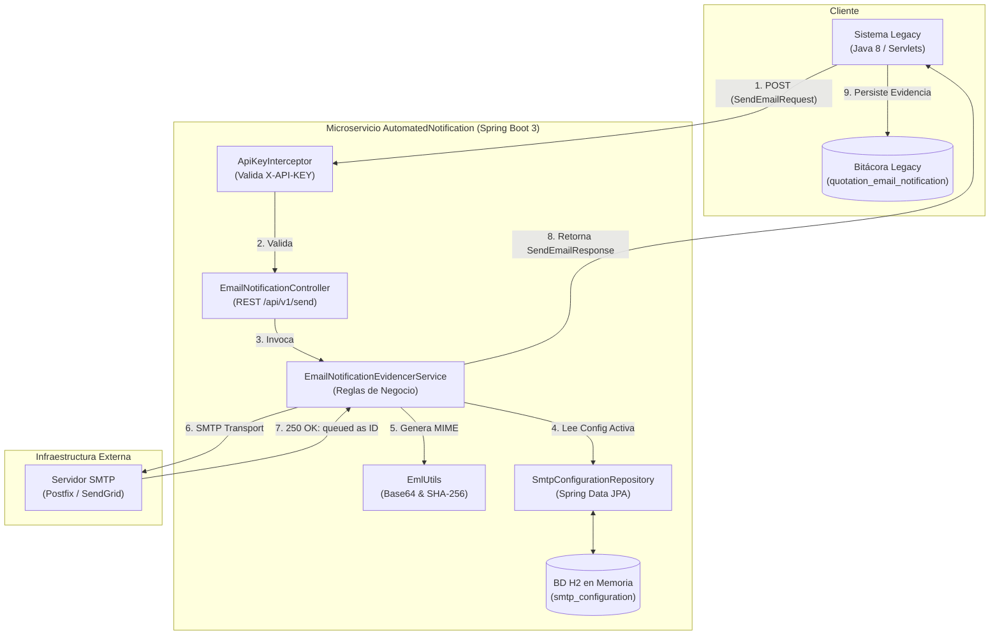
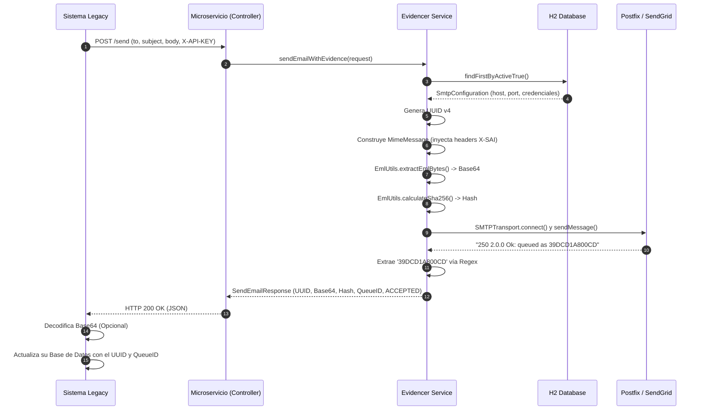

# Arquitectura del Sistema: Módulo de Evidencias de Notificación

Este documento consolida la arquitectura lógica y dinámica del sistema `AutomatedNotification` para mitigar la deuda técnica y proveer visibilidad al equipo de desarrollo e infraestructura.

## 1. Diagrama de Componentes (Arquitectura Lógica)

El sistema opera como un microservicio independiente (Sidecar o Standalone) que funciona de puente entre el sistema Legacy y el servidor SMTP.

## 2. Diagrama de Secuencia (Flujo Síncrono)

El siguiente diagrama detalla cómo fluye la transacción, la generación del UUID, la captura del EML crudo y la extracción del `queue_id`.

## 3. Decisiones Arquitectónicas (ADR - Architecture Decision Records)

| Decisión | Razón | Alternativa Rechazada |
| :--- | :--- | :--- |
| **Arquitectura Desacoplada (API REST)** | Aislar la complejidad del armado MIME moderno y la intercepción SMTP del código legado monolítico (Java 8). | Módulo embebido en el `.war` legacy. |
| **Hot-Swap de SMTP vía BD** | Permitir cambiar el servidor en caliente si ocurre un bloqueo de IP (Gmail) o saturación, sin reiniciar el microservicio. | Hardcodear credenciales en `application.properties`. |
| **Base64 como Transporte EML** | Garantiza que los bytes exactos del MIME no sufran mutaciones de encoding (UTF-8) al viajar por HTTP y ser guardados en la BD legacy. | Guardar archivos en el disco duro del microservicio. |
| **API Key Security** | Protección mínima (IDOR/Abuso) requerida en intranet para evitar spam interno. | Spring Security Completo con JWT (sobreingeniería para intranet). |
| **Jakarta Mail (Angus Mail)** | Implementación oficial en Spring Boot 3 para acceder a la API de bajo nivel `SMTPTransport` y leer el `LAST SERVER RESPONSE`. | Commons Email (No expone la respuesta 250 OK síncrona). |

## 4. Auditoría de Licencias (Compliance)
Todo el stack seleccionado es de categoría Open Source permisivo para uso corporativo cerrado:
*   **Spring Boot 3 / Framework:** Apache License 2.0.
*   **Hibernate / Spring Data JPA:** LGPL 2.1 (permite enlace dinámico en software cerrado sin infectar el código privativo).
*   **H2 Database:** MPL 2.0 o EPL 1.0 (permisivas).
*   **Jakarta Mail (Angus):** EPL 2.0 / GPL 2.0 with Classpath Exception (seguro para uso privativo).

**Resolución de Compliance:**
No existe software bajo licencia **AGPL (GNU Affero General Public License)** en este stack. La institución no está obligada a liberar el código fuente de su sistema legacy por utilizar o interactuar con este microservicio.
